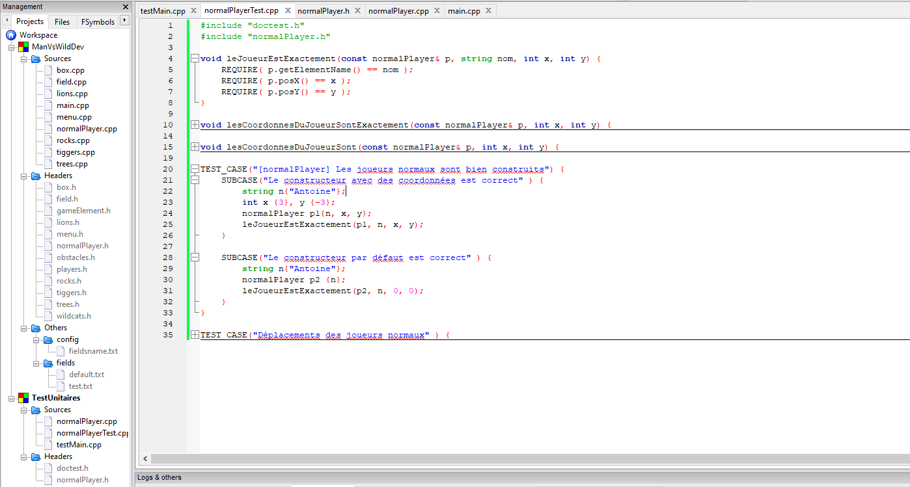

# ManVsWild

Projet pour la matière "Qualité de Programmation". 

## Utilisation du dépôt

### Si c'est la première fois
- Clonnez le dépôt à l'endroit souhaité
- Créer un projet vierge via CodeBlocks
- Copiez les fichiers du dépôt clonné et ajoutez les au projet vierge

Vous pouvez coder !

### Si vous avez déjà ce qu'il faut 
- N'oubliez pas de commit régulièrement vos avancées
- Communiquez vis-à-vis des parties que vous traitez
- N'oubliez pas de pull avant de commencer à coder /!\
- N'oubliez pas de push lorsque vous avez terminé

## Amélioration du diagramme UML

Pour changer le diagramme UML il suffit de récupérer le .drawio et d'aller sur le site drawio.
Vous pouvez ainsi changer le diagramme de base, n'oubliez pas de sauvegarder les changements au format .drawio et .png.

Enjoy !

## Tests unitaires

### Installation

* Installez [tdm-gcc](https://jmeubank.github.io/tdm-gcc/download/)
* Lancez codeblocks et se rendre dans settings -> compiler
* Cliquez sur "copy" en veillant à bien être sur "GNU GCC Compiler"
* Nommez ce nouveau profil comme vous le souhaitez /!\ donnez lui un nom contenant TDM (TDM GNU GCC Compiler, par exemple) afin de s'y retrouver plus facilement
* Se rendre dans "toolchain executables" (vérifier que vous êtes bien sur votre profil TDM)
* Re-sélectionnez "C compiler", "C++ compiler" en choisissant ceux se trouvant dans le dossier "bin" où vous avez installé tdm-gcc. Donc "gcc.exe" pour le compiler C et "g++.exe" pour le complier C++.
* Enfin, fermez la fenêtre après validation et rendez-vous dans project -> build options
* Changez le profil GNU GCC préselectionné pour le profil TDM

### Utilisation propre

Pour démarrer les tests de chaque classe, respecter l'arborescence ci-dessous : 

Il faut donc créer un nouveau projet pour éviter les conflits de main.

Pour chaque classe de test :

* Créer un fichier nomClasseTest.cpp
* Ajouter ce fichier au projet de tests unitaire 
* Ajouter les fichiers associés a la classe de test. Pour normalPlayerTest il faut donc ajouter normalPlayer.h et normalPlayer.cpp /!\

Bon tests !
